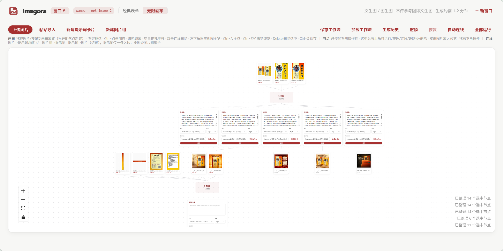
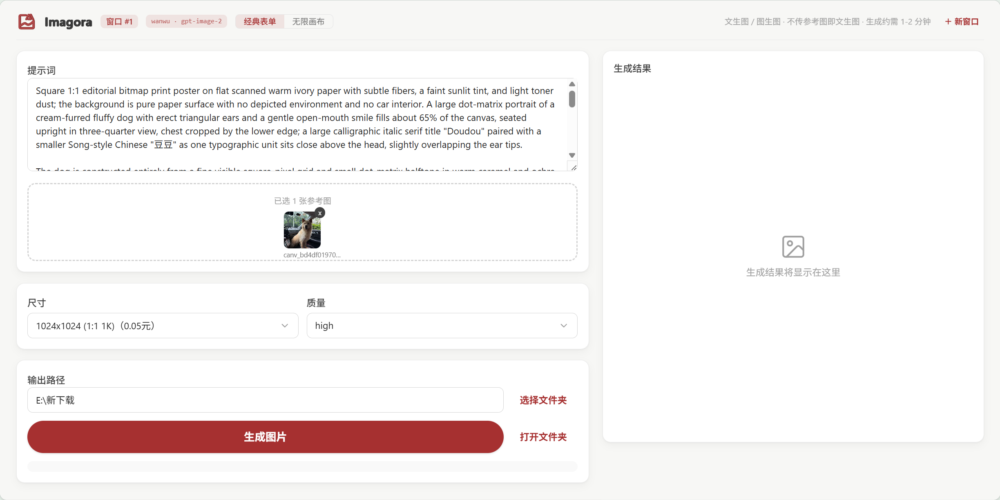
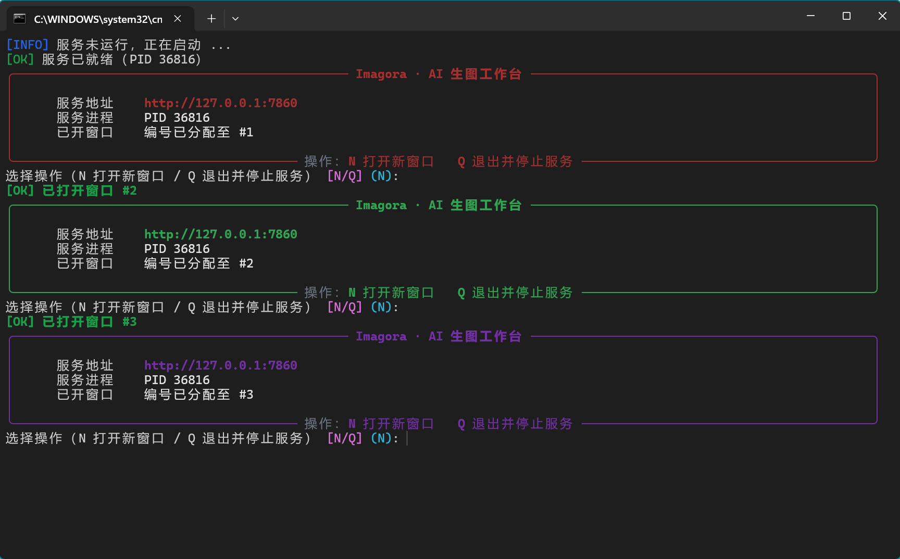

<div align="center">


<h1>Imagora | 意象集</h1>

<p>
  <a href="https://github.com/zlZayn/imagora/actions/workflows/ci.yml"></a>
  <a href="LICENSE"></a>
  <a href=".python-version"></a>
  <a href="frontend/package.json"></a>
</p>

<div align="center">
  <p>
    <strong><a href="README.md">简体中文</a></strong> · <a href="README_en.md">English</a>
  </p>
</div>

<p><b>一个本机运行的 AI 生图工作台</b></p>

<p>文生图与图生图一体，用无限画布编排工作流，提示词契约一键导入，多开窗口并行出图（主体色区分）。<br>
支持批量与命令行。提示词、参考图、任务、产物和花费全在同一处管理。</p>

<p>它不绑定场景——商品图、角色设定、封面海报、概念图、素材铺量，凡是能写成提示词的都能做。</p>

</div>

> **数据边界**　请求直连你配置的接口；密钥只留在本机 `.env` 里；图片与生成记录全落在本地目录，没有任何中转服务。

## 界面一览



| 经典表单 | 多窗口并行 |
| --- | --- |
|  |  |

界面已多次调整，上面几张图待重拍。

<!-- 待补图：外观弹窗打开态（主体色预设 + 卡片通透度滑杆） -->
<!-- 图注建议：顶栏右侧调色板图标打开外观弹窗 -->
<!-- 待补图：铺了壁纸的整页效果 -->
<!-- 图注建议：壁纸原图铺满整页，卡片与文字仍读得清 -->

## 四个主要能力

### 一句话出图

填提示词，点「生成图片」。不传参考图是文生图，传一张或几张就是图生图。
尺寸下拉里每个选项直接标着单价，质量可选、默认 high，输出目录记住你上一次用的。
参考图可以拖进来、`Ctrl+V` 粘贴、或点选，一次能带多张，也能逐张换掉或删掉。
没配密钥时页面顶部会直接提示，不会让你填完一整轮才发现跑不了。

### 无限画布

把提示词卡和图片摊在一张画布上，**连线就是参考关系**——图片连到提示词，这张图就是它的参考。
多张图可以先归进一个图片组，组与组还能再合，省去一根根连线。
跑法有三种：单张卡自己「运行」、「全部运行」、或选中几张「运行所选」。
出图后结果自动变成那张提示词正下方的新图片节点，可以直接接着往下连，不用把图搬来搬去。
经典表单出的某一张结果，也能一键导入当前画布继续改。

### 批量与复用

要一次出很多张，最快的办法是在画布上铺多张提示词卡，一起提交，服务端排队并发跑，每张出图各自回流。
模型给你的整段提示词，粘进「粘贴导入」就实时显示识别出几张卡、每张什么比例，确认后一次建完；格式不对的地方逐条标红，不会建成半张废卡。
要同时跑多套互不相干的活：开多个窗口，编号由服务端分配不会撞，新窗口自动带上当前窗口的尺寸、质量和输出位置（提示词不带，避免你以为还在改上一条）。
命令行也支持批量：一份提示词清单交给它逐张跑，跑之前可以先看一遍预计花多少，预览不花钱。

### 钱花在哪，一眼看得见

生成历史面板顶部就是成本看板：今日花费、累计花费、成功率、失败数、成功平均耗时，另有按尺寸的分布。
**这个面板在画布页的工具栏上，经典表单页没有**——要找历史、看板上任何数字，都从那儿进。
可以设两道上限：日预算和单次上限，填 0 表示不限（默认不限，不打扰）。每次提交前会先算一次账，超了就弹确认，写清「今天已花多少 + 这次预计多少」，你点确认才会真的提交；多个窗口同时提交也拦得住。
失败的记录可以在面板里看清原因（缺失的参考图会单独计数）；要重新生成就回画布改好再跑一次。

## 功能地图

### 出图时

| | |
| --- | --- |
| 尺寸与比例 | 先选比例，再选 1K / 2K / 4K 档位，分辨率自动换算 |
| 输出格式 | png / jpg / webp，文件名带后缀就以后缀为准 |
| 生成耗时 | 一般几十秒到两分钟；提示词用英文更稳 |
| 最近用过的提示词 | 结果区空态时列出来，点一条填回输入框 |

### 管结果

| | |
| --- | --- |
| 生成历史 | 按提示词、质量或文件名搜索，可按成功失败筛选，滚到底自动续页 |
| 大图预览 | 双击图片全屏，滚轮缩放、拖拽平移，一键回到实际大小或适应窗口 |
| 输出位置 | 手输路径或选文件夹，生成后一键在资源管理器打开 |
| 日志 | 只留最终结果和操作反馈，里面出现的本机路径可点走复制 |
| 工作流 | 画布按名字保存与还原，同名会先问；项目改名或搬家后老工作流仍能恢复 |

### 换配置

| | |
| --- | --- |
| 多套供应商 | 地址、模型、尺寸、价格并存在一份配置文件里，一行切换；标题栏看得出当前用的是哪套 |
| 界面里改配置 | 顶栏模型角标 → 配置弹窗：改地址 / 模型 / 路径 / 密钥，写回本机 `.env`；改哪项提示哪项待重启 |
| 改不动就手改 | 弹窗和文本编辑器改的是**同一份文件**，两者等价；配置只有一份，没有「浏览器里另一套」 |

### 界面观感

| | |
| --- | --- |
| 主体色 | 一组预设色加色相微调；多窗口按编号自动错开颜色，标签页图标跟着变 |
| 背景 | 跟随主体色或纯白两种底色；整页背景图用你自己上传的图 |
| 卡片通透度 | 可以拉到近乎全透明；输入框另有一道可读性底线，字不会压在花哨背景上发飘 |
| 画布边框 | 可以关掉，让画布和页面底色融为一体 |

## 跑起来

### 1. 需要准备

Python 3.12 和 [`uv`](https://docs.astral.sh/uv/)；要改界面再加 Node 与 `npm`。
本项目以 Windows 为主要使用与验证平台。

### 2. 配密钥

```powershell
Copy-Item .env.example .env
# 编辑 .env，填入当前 profile 对应的密钥，例如 API_KEY_WANWU=sk-你的Key
```

`.env` 已被 git 忽略，不会进仓库。也可以先不配，启动后在顶栏模型角标里打开配置弹窗填入——那份同样写进本机 `.env`。

> **本地加速（可选）**　依赖默认从官方 PyPI 装。国内如果嫌慢，改**本机**的
> `%APPDATA%\uv\uv.toml`（Windows）或 `~/.config/uv/uv.toml`，加一行
> `index-url = "https://pypi.tuna.tsinghua.edu.cn/simple"`。
> **别把这种状态下的 `uv.lock` 提交上来**——锁文件会把源固化到每个包（连绝对下载 URL），
> 提交后海外 CI 会连不上。`: uv lock --check` 能查出锁是否漂了。

### 3. 启动

双击根目录的 `启动生图工作台.exe`：自动检查前端是否已构建 → 起服务 → 开一个窗口 → 进入交互菜单，按 `N` 开下一个窗口，按 `Q`（或关窗）连根停掉服务。

或者手动起：

```powershell
uv run python -m main ui --port 8080
```

### 4. 第一次出图

进页面 → 填一句提示词 → 选尺寸和质量 → 点「生成图片」。
一两分钟后结果出现在右侧，同时进生成历史。到这里就通了，剩下的都是在画布上把它连成流程。

### 5. 常用命令

| 命令 | 用途 |
| --- | --- |
| `uv run python -m main gen "a red apple" --size 1024x1024 --quality high -o out.png` | 单张生成 |
| `uv run python -m main batch --config <项目目录>\batch_prompts.json --dry-run` | 批量预览，不花钱 |
| `uv run python -m main config` | 看当前这套配置支持哪些尺寸、比例、质量 |

测试、构建、E2E 这些开发命令见 [AGENTS.md](AGENTS.md)。

## 命令行

`gen` 与网页等价，产物进同一份生成历史，两边可以互查。

```powershell
uv run python -m main gen "a red apple on white background" --size 1024x1024 --quality high -o out.png
```

可用的尺寸、比例、质量与默认档位，以 `python -m main config` 的实时输出为准——它们跟着配置走，文档里抄一份必然过期。

## 从哪来

最初是为了网店商品图：每款商品要出轮播图和详情图，人工逐张做约需一个半小时，而且多模态模型返回的提示词格式不稳定，没法直接批量处理。
把「参考图理解 → 提示词规范 → 批量出图 → 产物与费用记录」整条链路固化成工具，再用一份严格的输出规范约束模型回复之后，同一件事降到十五分钟左右，之后交接给同事持续在用。

格式规范见 [docs/prompt-import-format.md](docs/prompt-import-format.md)（通用）与 [docs/ecom-prompt-import-format.md](docs/ecom-prompt-import-format.md)（商品图专用顺序）。
这段是它被造出来的原因，不是它的边界。

## 更多

想改代码或看内部机制：[AGENTS.md](AGENTS.md)（改一处要同步哪几处）· [docs/ARCHITECTURE.md](docs/ARCHITECTURE.md)（数据流、契约、防错清单）· [frontend/README.md](frontend/README.md)（前端模块与样式体系）。

## 贡献

个人项目，欢迎提 issue 与 PR。改动前先看 [AGENTS.md](AGENTS.md)，它写明了改哪类东西要同步哪些文件和跑哪些校验。

## License

[MIT](LICENSE) © 2026 陈盛泷 (Chen Shenglong), zlZayn (Zayn Liu)
